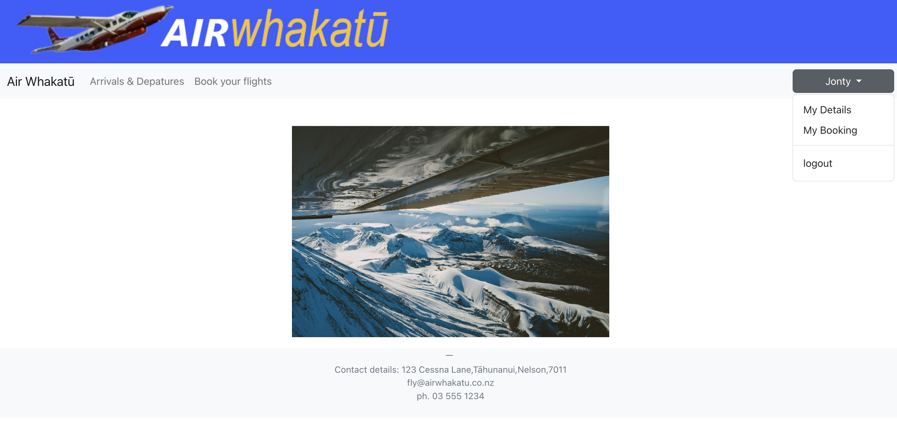
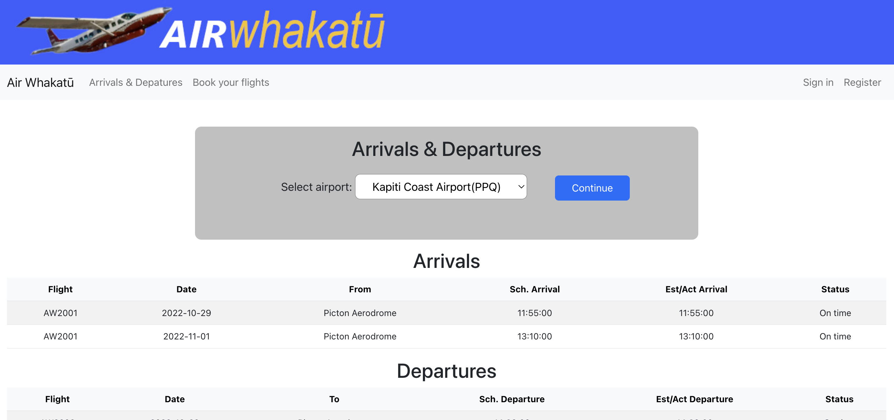
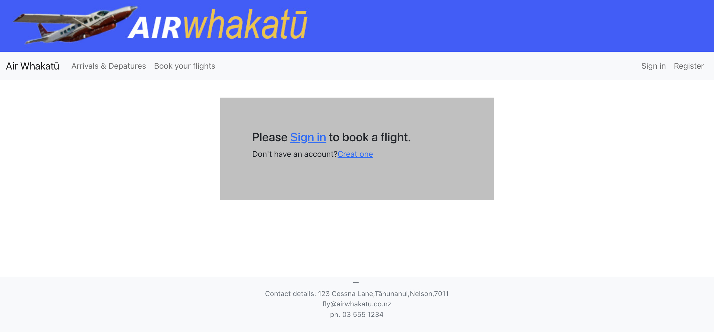
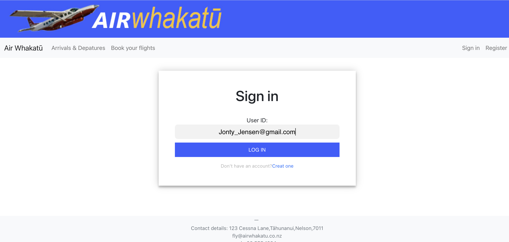
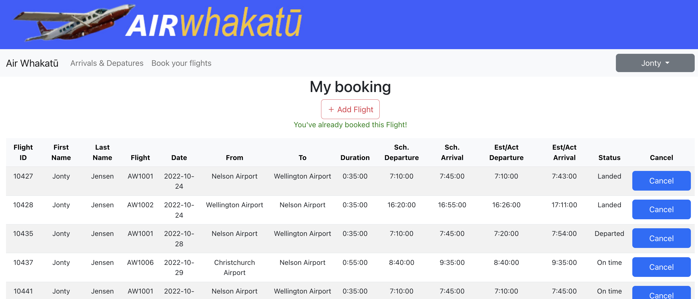
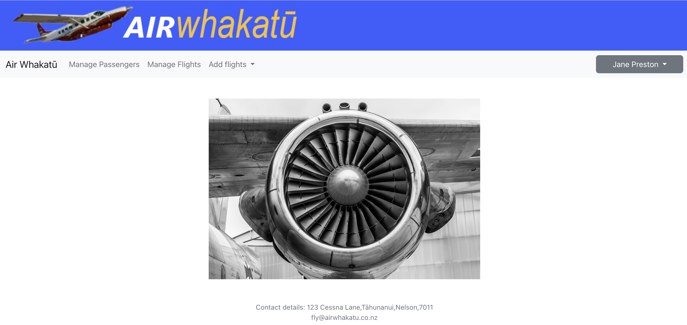
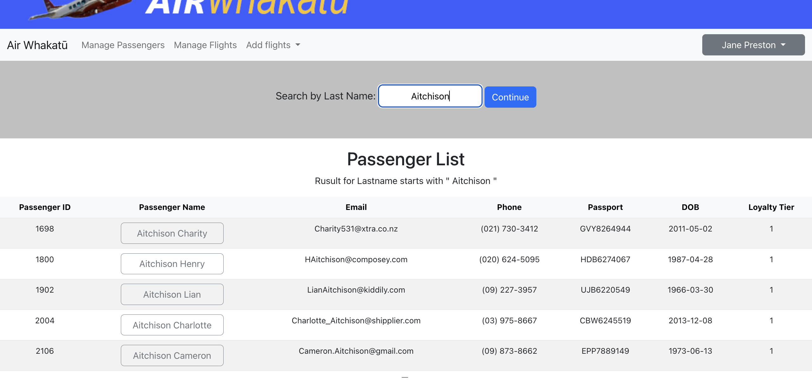
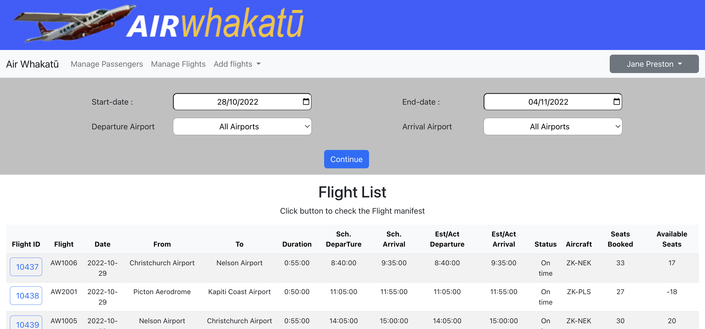

# My very First Full-Stack Personal Website

Hosted on pythonAnywhere:

https://zhiyizhu805.pythonanywhere.com/           (UserID:   ABartrum3@hotmail.com)

https://zhiyizhu805.pythonanywhere.com/admin

## Introduction

This repository contains my first full-stack personal website which established in 2022, built at the beginning of my programming journey. As my maiden project, it was instrumental in laying the foundation for my subsequent group projects, where I was able to learn and improve further.

While this project is a significant milestone for me, it comes with its own set of limitations and shortcomings, which I recognize and embrace as part of the learning process. Some of the areas where it lacks include:

- **Poor CSS Design:** The styling and layout might not be visually appealing or follow best practices.
- **Lack of Proper Structure:** The code organization and separation of concerns are not well-defined.
- **Limited Code Reuse:** There was little focus on creating reusable components or functions, leading to some code duplication.

Despite these limitations, this project holds a special place in my heart 🤣 and serves as a reminder of where I started and how far I've come🥹. It's a living testament to my growth and continuous learning in the field of software development.

## Usage

Here's how you can get started with this project:

1. **Clone the Repository:** Use `git clone <repository-url>` to clone the project to your local machine.
2. **Install Dependencies:** Navigate to the project folder and run `pip install -r requirements.txt` to install the required Python packages.
3. **Start the Server:** Run `python app.py` to start the Flask server.
4. **Access the Website:** Open your browser and navigate to `http://127.0.0.1:5000/`  `http://127.0.0.1:5000/admin` to access the website.

## Conclusion

This project serves as a stepping stone for my programming career and a symbol of continuous learning and growth. Your feedback and suggestions are always welcome as they will help me to refine and enhance my skills further.

## passenger page:

## admin page:

